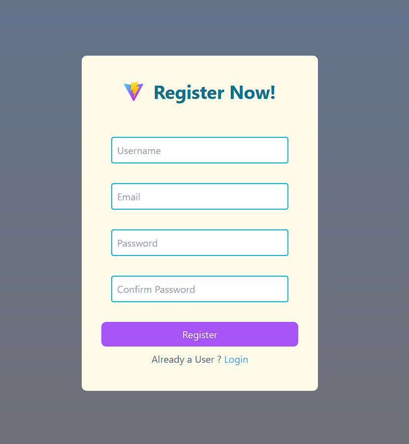
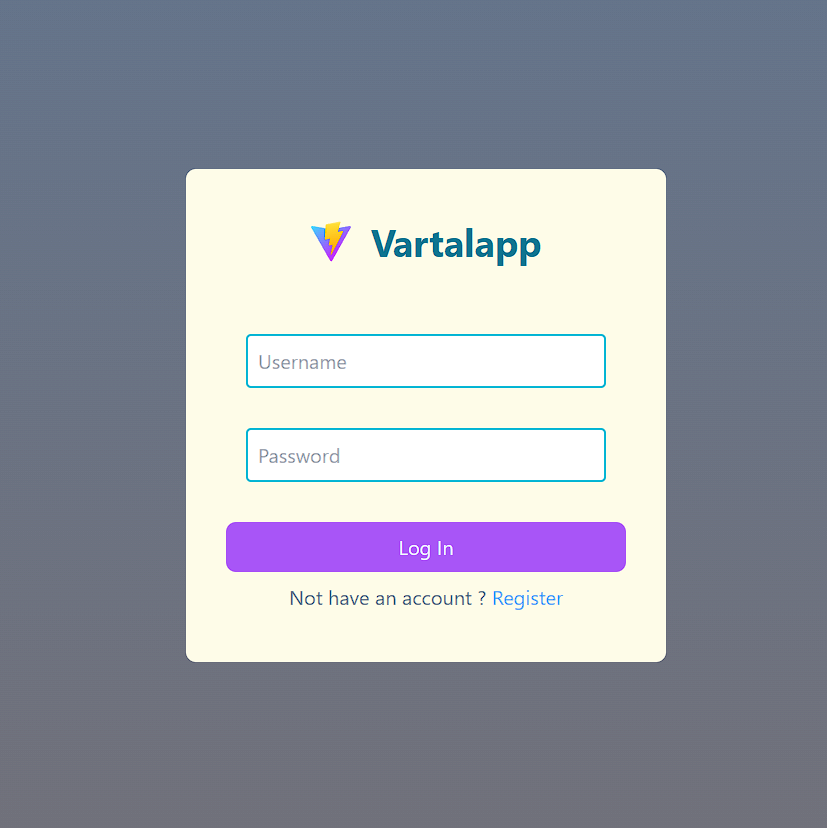
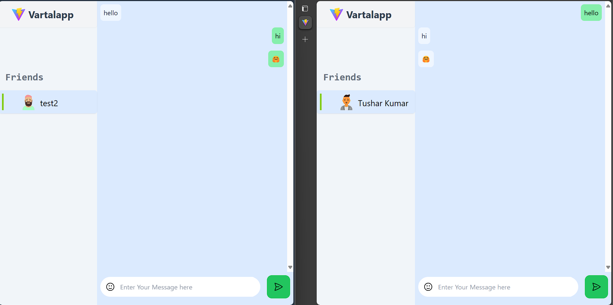

# Vartalapp

Vartalapp is a communtiy based chat application created using MERN Stack.


## Features

- Login/Register using email
- Realtime chat functionality
- One to One secure chat
- Emoji sharing support 
- Custom Avatar for all users


## Screenshots






## Installation
### Frontend
Follow these steps to set up and run the project on your local machine:

1. **Clone the repository:**

    ```bash
    git clone <repository-url>
    ```

    Replace `<repository-url>` with the URL of your GitHub repository.

2. **Navigate to the project directory:**

    ```bash
    cd vartalapp
    ```

3. **Install dependencies:**

    ```bash
    npm install
    ```

4. **Start the development server:**

    ```bash
    npm run dev
    ```

    This command runs the Vite development server.

5. **Open your web browser and navigate to [http://localhost:5173](http://localhost:5173) to view the app.**


### Backend
Follow these steps to set up and run the backend server on your local machine:

1. **Clone the repository:**

    ```bash
    git clone <repository-url>
    ```

    Replace `<repository-url>` with the URL of your GitHub repository.

2. **Navigate to the backend directory:**

    ```bash
    cd backend
    ```

3. **Install dependencies:**

    ```bash
    npm install
    ```

4. **Start the server:**

    ```bash
    npm run server
    ```

    This command uses Nodemon to automatically restart the server when changes are detected in the source code.
    
